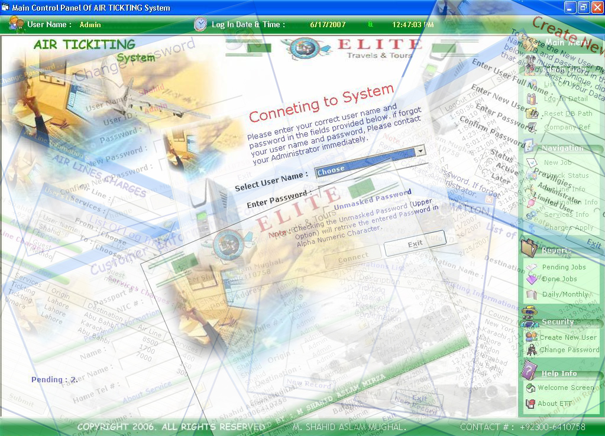



## Traveling Agency

### Description

This is a complete application that was designed for Traveling Agency to manage their Products, Customers and sales etc.
 
### More Info
 
Copy following OCX file to System32 folder.

LVbuttons.ocx &amp; ctrlNSDataCombo.ocx

make ODBC with Name "Travel Agency"

Password is "admin" with Admin USer Name

             |
---                |---
**Submitted On**   |2007-06-17 13:32:24
**By**             |[Shahid Mirza](https://github.com/Planet-Source-Code/PSCIndex/blob/master/ByAuthor/shahid-mirza.md)
**Level**          |Advanced
**User Rating**    |5.0 (20 globes from 4 users)
**Compatibility**  |VB 6\.0
**Category**       |[Coding Standards](https://github.com/Planet-Source-Code/PSCIndex/blob/master/ByCategory/coding-standards__1-43.md)
**World**          |[Visual Basic](https://github.com/Planet-Source-Code/PSCIndex/blob/master/ByWorld/visual-basic.md)
**Archive File**   |[Traveling\_2071356172007\.zip](https://github.com/Planet-Source-Code/shahid-mirza-traveling-agency__1-68841/archive/master.zip)

